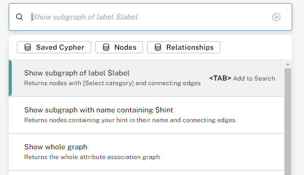
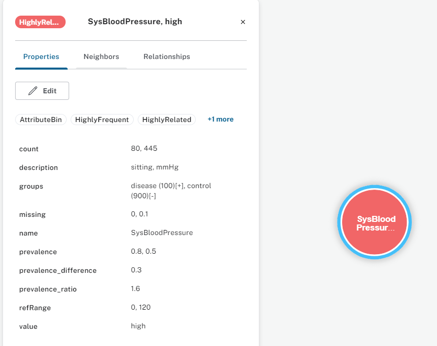
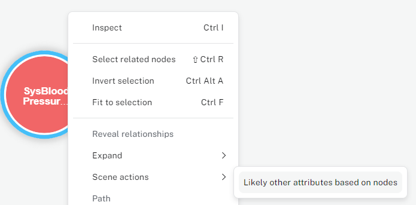

# Attribute Association Graph Navigation in Neo4J Bloom
{: .no_toc }

{: .note }
If you not yet configured Neo4J Bloom, check out [here](/neo4j_installation#configure-attribute-association-graph-visualization)

If you used Neo4J Bloom before, you will most likely be familiar with most of the functionalities 
described here. Notice that Neo4J Bloom was developed independently of GraphXplore, and we only 
configured it to our needs. You don't need coding or scripting skills to operate Neo4J Bloom, your 
only interactions are via mouse-clicking and search bar prompts. Checkout a 
[quick start introduction](https://neo4j.com/docs/bloom-user-guide/current/bloom-quick-start/) by Neo4J the developers 
themselves. 
If you are an advanced user and want to query the graph databases yourself, check out a 
[visual tour](https://neo4j.com/docs/browser-manual/current/visual-tour/) of Neo4J Browser. 
However, the rest of this guide will focus on Neo4J Bloom. 

## Table of contents
{: .no_toc .text-delta } 
- TOC
{:toc}

## Search Bar

When you start your exploration, the main instrument will often be the search bar in the upper left 
corner. Here, you can display the whole graph or parts of it in three different ways:
- Type or click on "Show whole graph" to display the whole AAG. You can dismiss parts of the graph 
  from the visualization later on
- Type or click on "Show subgraph of label " followed by a table or variable label assigned during 
  metadata annotation. All available labels will be displayed for auto-completion. Press <Tab> to 
  finish the statement. All attribute nodes with this label and their connecting edges will be 
  added to the visualization
- Type or click on "Show subgraph with name containing " followed by a string. Press <Tab> to 
  finish the statement. All attribute nodes with the string contained in their variable name 
  together with their connecting edges will be added to the visualization

<figure>
  
  <figcaption style="font-style: italic;">Search bar prompting</figcaption>
</figure>

## Interacting with Nodes
                    
Nodes are depicted as colored circles with the variable name of the attribute displayed in bold and 
followed by the variable value. You can select nodes by clicking on them. If you want to select 
multiple nodes, you do so with pressing `Ctrl` while left-clicking. You can dismiss one or multiple 
nodes from the visualization by right-click and "Dismiss".  
You can inspect the data of a node by either double-clicking on it, or right-clicking and then choosing "Inspect". A 
window opens displaying all node labels and parameters. The labels are given in the upper part and the parameters in 
the lower part. [Here](/aag_intro/aag_nodes) you read more about the parameter and label meanings.

<figure>
  
  <figcaption style="font-style: italic;">Node parameter view</figcaption>
</figure>

When right-clicking on one or multiple nodes, you can add edges and/or neighboring nodes:
- Add interconnecting edges by clicking on "Reveal relationships"
    - Only possible when you selected multiple nodes that share at least one edge
- Add neighboring nodes with
    - "Expand" to add edges based on their type
    - "Scene actions"->"Likely other attributes based on nodes" to add top 5 edges with highest 
      summed conditional prevalence

<figure>
  
  <figcaption style="font-style: italic;">Get high conditional dependency edges</figcaption>
</figure>

## Interacting with Edges

Edges are depicted as arrows with their type displayed directly above them. Same as nodes, you can 
select them via left-click or select multiple edges with `Ctrl` and left-click. You can dismiss one or 
multiple edges from the visualization by right-click and "Dismiss".  
You can inspect the data of the edge by double-clicking or right-click and "Inspect", a new window 
opens. The edge type is displayed on top of the window. In the middle, the edge parameters are 
shown. Explanation of edge type and parameters can be accessed [here](/aag_intro/aag_edges). In the lower part of 
the window, the source and target node data are displayed and can 
be expanded.

<figure>
  
  <figcaption style="font-style: italic;">Edge parameter view</figcaption>
</figure>