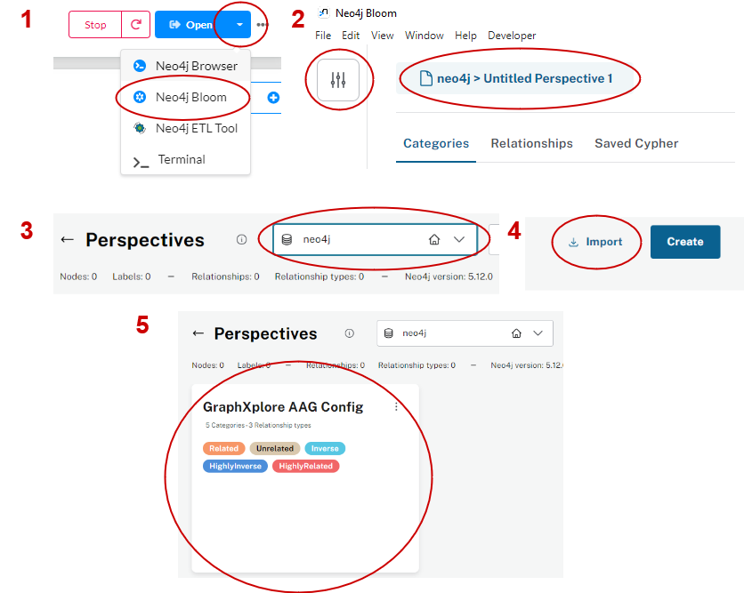
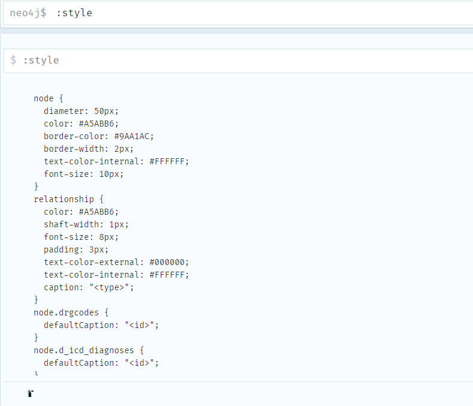

# Setup Neo4J
{: .no_toc }

GraphXplore is based on the Neo4J graph-based data platform. Here, you can read information on how 
to install Neo4J and configure it for the usage with GraphXplore.

## Table of contents
{: .no_toc .text-delta } 
- TOC
{:toc}

## Installation

In this section you can read how to install the Neo4J Desktop tool and configure it. Alternatively, you can 
[setup Neo4J with Docker](https://neo4j.com/developer/docker-run-neo4j/).
For installation of Neo4J Desktop, follow these steps:
- [Download](https://neo4j.com/download/) and install Neo4J Desktop, and start the application
- In Neo4J Desktop, click on Projects in the upper left corner and add a new project. Optionally, you can 
  rename the project

<figure>
  
  <figcaption style="font-style: italic;">Creating new project</figcaption>
</figure>
- Next, how have to add a new database management system (DBMS) to your Project:
  - Click on your project in the left corner
  - then on "Add"
  - Add a local DBMS

<figure>
  
  <figcaption style="font-style: italic;">Add new DBMS</figcaption>
</figure>

- GraphXplore requires the APOC plugin for Neo4J. To install it:
   - Click on your newly created DBMS
   - then on "Plugins" to the right
   - Click on "APOC" and then on "Install"

<figure>
  
  <figcaption style="font-style: italic;">Install APOC plugin</figcaption>
</figure>

## Configure Attribute Association Graph Visualization

{: .note }
This section is only relevant, if you already created an attribute association graph

### Neo4J Bloom Configuration

We recommend visually exploring AAGs in [Neo4J Bloom](https://neo4j.com/product/bloom/). When you use Neo4J Bloom for a 
new AAG, you need to add configurations for the visualization.
Before installation make sure that:
- Neo4J Desktop and the DBMS containing the AAG are running
- You have the config file ready, if not [get it here](https://github.com/UKEIAM/graphxplore/blob/master/frontend/GraphXplore/bloom_config.json)

In Neo4J Desktop/Bloom:
1. Click on the dropdown next to the blue "Open" button on the top right of the window, and 
   click on "Neo4J Bloom"
2. After Neo4J Bloom opens, click on the control icon in the upper left corner of the windows 
   and then on the button with "... Untitled Perspective..."
3. Select the database containing your AAG from the drop-down
4. Click on "Import" and select the GraphXplore config file
5. Click on the white card "GraphXplore AAG Config", an empty scene will open where you can 
   explore your AAG!

<figure>
  
  <figcaption style="font-style: italic;">Steps to configure Neo4J Bloom</figcaption>
</figure>

### Neo4J Browser Configuration

If you are an advanced user and you want to query AAGs in the Neo4J Browser, you can add visualization styling to adapt 
the Neo4J Browser looks to that of your AAGs in Bloom. Follow these steps:

- Have Neo4J Desktop (or a Docker container) accessible and the DBMS containing the AAG running
- Have the styling file ready, or [get it here](https://github.com/UKEIAM/graphxplore/blob/master/frontend/GraphXplore/browser_style.grass)
- Open Neo4J Browser by clicking on the blue "Open" button on Neo4J Desktop, or access the 
  Docker container Neo4J Browser
- Type `:style` in the Neo4J Browser query command line
 - Drag and drop the styling file, you are ready to go!

<figure>
  
  <figcaption style="font-style: italic;">Styling in Neo4J Desktop</figcaption>
</figure>