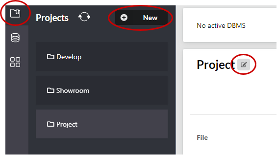
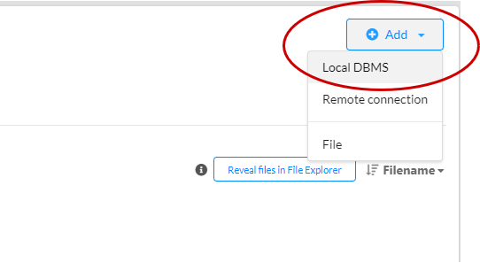
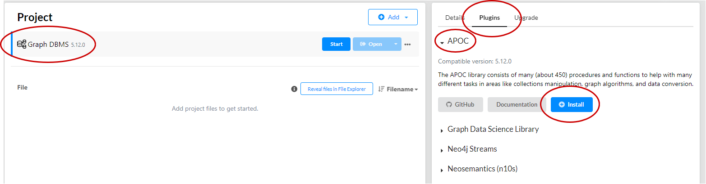

# Setup Neo4J
{: .no_toc }

GraphXplore is based on the Neo4J graph-based data platform. Here, you can read information on how 
to install the Neo4J and configure it for the usage with GraphXplore.

## Table of contents
{: .no_toc .text-delta } 
- TOC
{:toc}

## Installation

In this section you can read how to install the Neo4J Desktop tool and configure it. Alternatively, you can 
[setup Neo4J with Docker](https://neo4j.com/developer/docker-run-neo4j/).
For installation of Neo4J Desktop, follow these steps:
- [Download](https://neo4j.com/download/) and install Neo4J Desktop, and start the application
- In Neo4J Desktop, click on Projects in the upper left corner and add a new project. Optionally, you can 
  rename the project

<figure>
  
  <figcaption style="font-style: italic;">Creating new project</figcaption>
</figure>
- Next, how have to add a new database management system (DBMS) to your Project:
  - Click on your project in the left corner
  - then on "Add"
  - Add a local DBMS

<figure>
  
  <figcaption style="font-style: italic;">Add new DBMS</figcaption>
</figure>

- GraphXplore requires the APOC plugin for Neo4J. To install it:
   - Click on your newly created DBMS
   - then on "Plugins" to the right
   - Click on "APOC" and then on "Install"

<figure>
  
  <figcaption style="font-style: italic;">Install APOC plugin</figcaption>
</figure>

## Configure Attribute Association Graph Visualization

{: .note }
This section is only relevant, if you already created an attribute association graph

### Neo4J Bloom Configuration

We recommend visually exploring AAGs in [Neo4J Bloom](https://neo4j.com/product/bloom/). When you use Neo4J Bloom for a 
new AAG, you need to add configurations for the visualization.